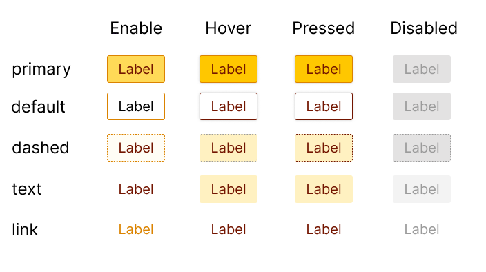

# Patika / React - Hava Durumu Uygulaması

## [ Patika Profil](https://app.patika.dev/pooldata)

## Ekran görüntüleleri



```sh
> npm i beeuikit
```

## Kullanımı

```js
import React, { Component } from 'react'

import MyComponent from 'beeui'
import 'beeui/dist/index.css'

const App = () => {
  return <Button type="primary">Primary</Button>
  </>
}

export default App
```
